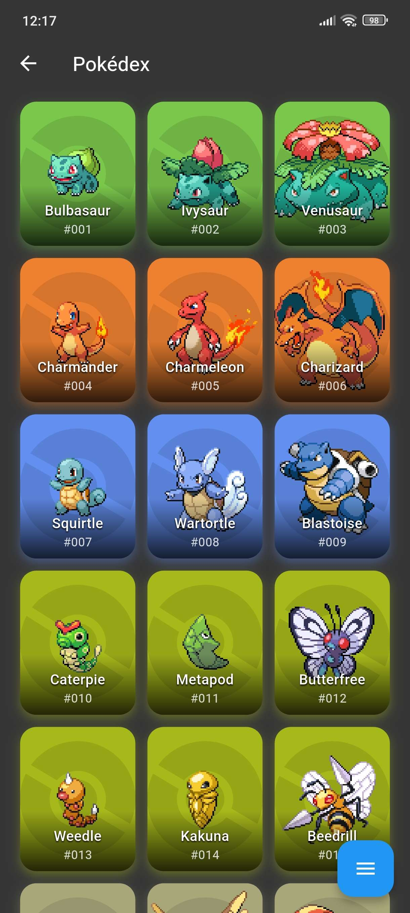
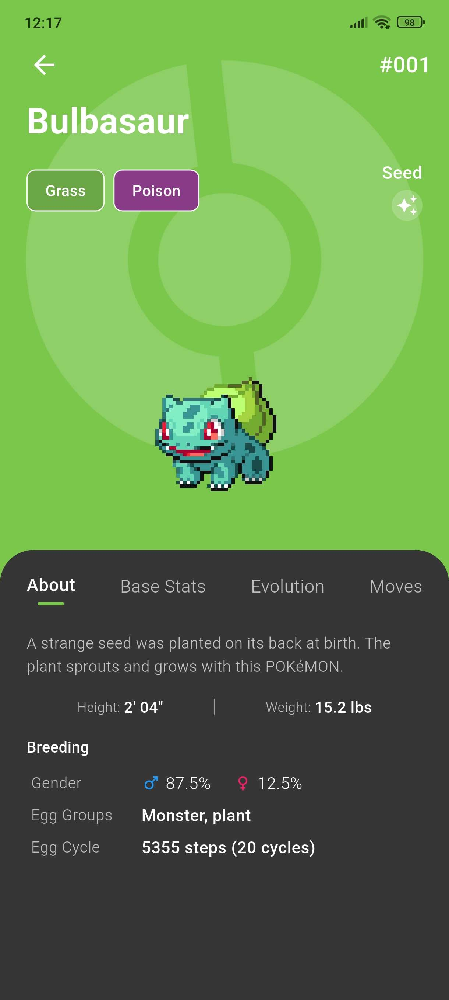
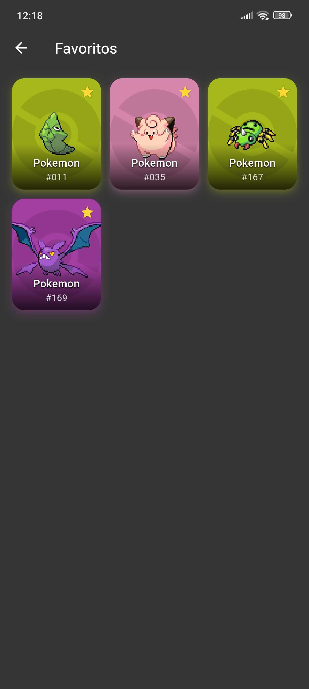
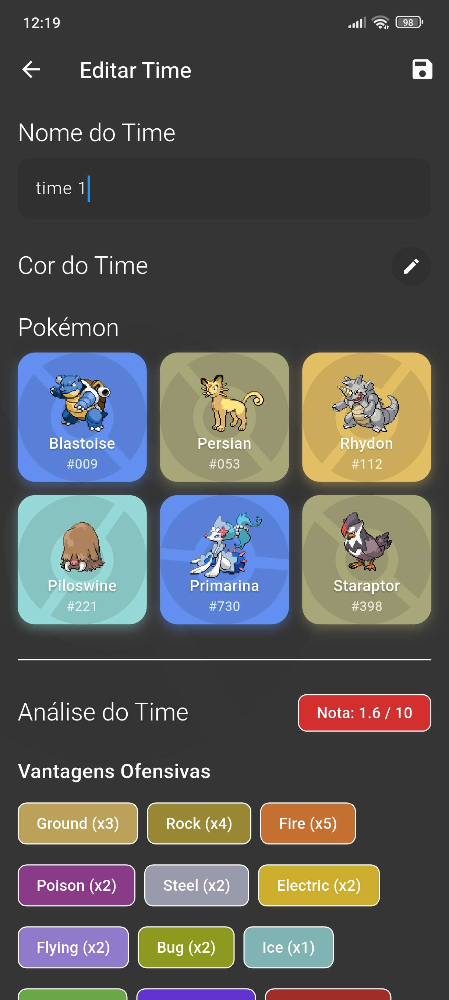
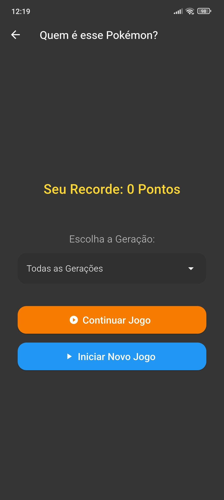
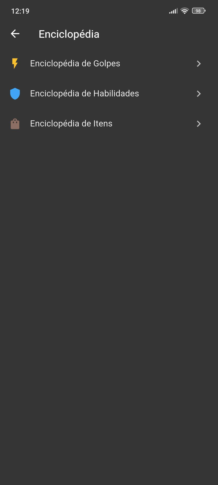
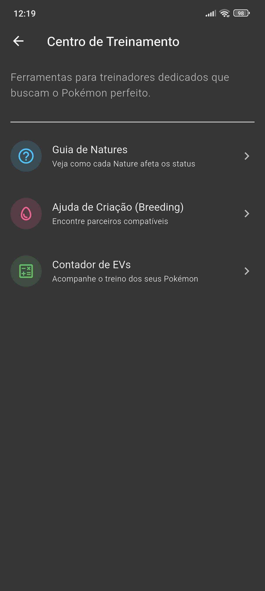

# 📱 Pocketdex

<p align="center">
  
  
  
</p>

<div align="center">
  <h3>Sua Enciclopédia Pokémon Definitiva e Assistente Competitivo</h3>
  <p>Aplicativo Flutter de alto desempenho para consulta de dados, gerenciamento de times e treinamento técnico de Pokémon.</p>
</div>

---

## 📸 Screenshots

<p align="center">
  
  
  
  
</p>
<p align="center">
  
  
  
  
</p>

---

## ✨ Funcionalidades Principais

### 🔍 Exploração e Enciclopédia
* **Pokédex Avançada:** Navegue por todas as gerações com listagem dinâmica e filtros inteligentes por tipo. Consumo em tempo real da **PokeAPI**.
* **Detalhes Profundos:** Status base, habilidades, linhas evolutivas completas e formas alternativas (Mega Evoluções, Alola, Galar, etc.).
* **Enciclopédia de Itens e Moves:** Módulos dedicados para busca técnica de movimentos e itens de segurar.

### ⚔️ Ferramentas Competitivas
* **Team Builder:** Crie e gerencie múltiplas equipas, organizando sua estratégia antes das batalhas.
* **EV Counter & Tracking:** Ferramenta integrada para registar o ganho de *Effort Values* durante o treino. Permite monitorizar o progresso exato de cada atributo.
* **Breeding Help & Partners:** Guia para encontrar parceiros compatíveis e otimizar o cruzamento de Pokémon.
* **Nature Guide:** Consulta rápida de modificadores de atributos baseados na Nature.

### 🎮 Experiência do Usuário
* **Pokémon Quiz:** Teste seus conhecimentos com um mini-game integrado e sistema de recordes.
* **Sistema de Favoritos:** Guarde seus Pokémon mais utilizados para consulta rápida.
* **Temas Personalizados:** Suporte completo para **Modo Escuro** e **Modo Claro** via `ThemeProvider`.

## 🛠️ Stack Técnica

* **Framework:** Flutter (Dart).
* **Gestão de Estado:** `Provider` (utilizado para Temas e Favoritos).
* **Persistência:** `Shared Preferences` para configurações e dados locais.
* **UI/UX:** Tipografia **Circular Std** e cores dinâmicas baseadas nos tipos dos Pokémon.

## 📥 Como Baixar (APK)

1. Vá até a seção de [**Releases**](https://github.com/OctavioKonzen/Pocketdex/releases).
2. Baixe o arquivo `app-release.apk` da versão mais recente.
3. Instale no seu Android (lembre-se de permitir a instalação de fontes desconhecidas).

---

## 🚀 Como Rodar o Código

```bash
# Clone o repositório
git clone [https://github.com/OctavioKonzen/Pocketdex.git](https://github.com/OctavioKonzen/Pocketdex.git)

# Instale as dependências
flutter pub get

# Execute o projeto
flutter run
