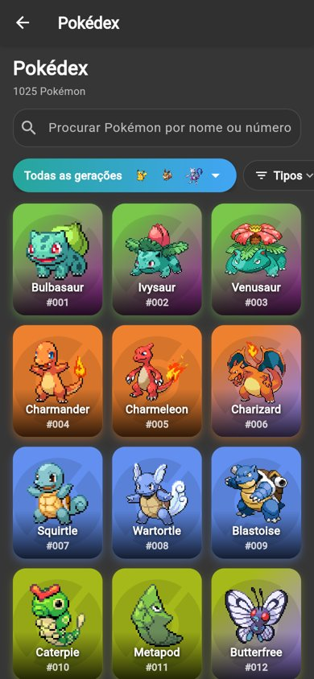
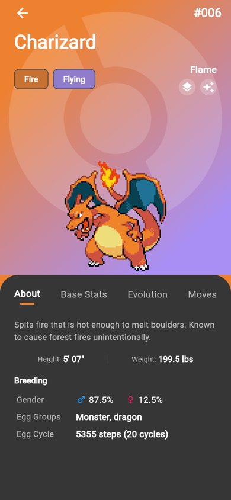
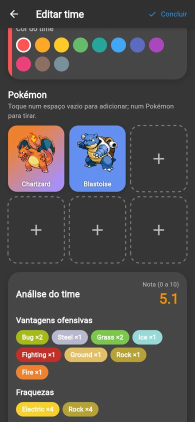
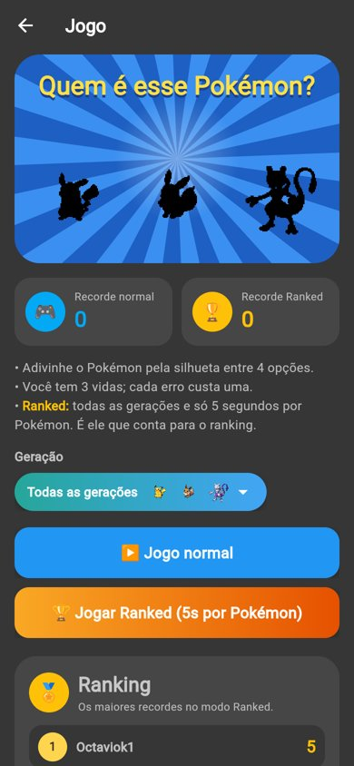
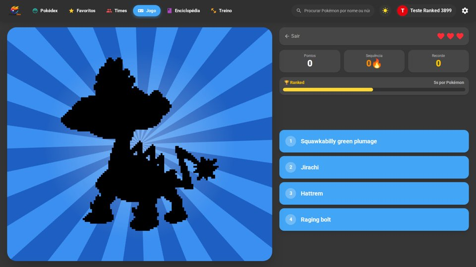
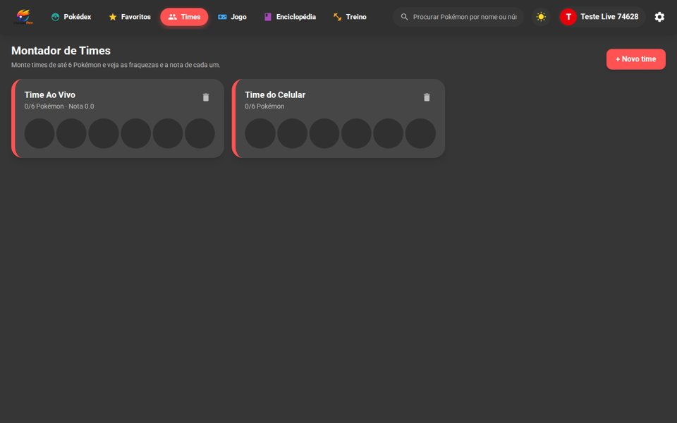

# 📱 Pocketdex

<p align="center">
  
  
  
  
</p>

<div align="center">
  <h3>Sua Enciclopédia Pokémon e Assistente Competitivo</h3>
  <p>App Android e site ligados pela mesma conta.</p>
  <p>🌐 <a href="https://octaviokonzen.github.io/Pocketdex/"><b>Abrir o site</b></a> · 📥 <a href="https://github.com/OctavioKonzen/Pocketdex/releases"><b>Baixar o APK</b></a></p>
</div>

---

## 📸 Screenshots

<p align="center">
  
  
  
  
</p>
<p align="center">
  
  
</p>

---

## ✨ O que tem no projeto

* **Pokédex:** todos os Pokémon e formas (Mega, Alola, Galar...), com filtros por geração e tipo e detalhes completos: status, habilidades, evoluções e golpes.
* **Favoritos:** guarde os Pokémon que você mais usa.
* **Montador de Times:** monte times de até 6 Pokémon, veja fraquezas, resistências e a nota do time, e compartilhe por link, código ou no formato do Pokémon Showdown.
* **Jogo "Quem é esse Pokémon?":** modo normal, modo **Ranked** (5 segundos por Pokémon, caindo até 2 conforme os pontos) e **Desafio do dia** (os mesmos 10 Pokémon para todos), com rankings geral, da semana e do dia.
* **Conquistas:** medalhas por jogar, montar times e favoritar Pokémon.
* **Enciclopédia:** golpes, habilidades e itens.
* **Treino:** guia de Natures, ajuda de Breeding, contador de EVs, comparador de Pokémon e calculadora de dano.
* **Conta:** login com e-mail/senha ou Google, foto de perfil e opção de excluir a conta; favoritos, times, treinos e recordes ficam salvos e sincronizados entre o app e o site.
* **Tema claro e escuro** e **atualização pelo próprio app**.

## 🛠️ Ferramentas usadas

| Parte | Ferramentas |
|---|---|
| **App (Android)** | Flutter / Dart, Provider |
| **Site** | React, Vite, Tailwind CSS, Framer Motion, React Router, Zustand |
| **Conta e dados online** | Firebase Authentication e Firestore |
| **Banco de dados local** | JSON e imagens em `assets/database/`, gerados com Python a partir da PokeAPI |
| **Publicação** | GitHub Actions (conferência automática, site no GitHub Pages e APK em Releases) |

## 📥 Como usar

* **Site:** https://octaviokonzen.github.io/Pocketdex/
* **App:** no site, clique em **Baixar app** (ou vá em [Releases](https://github.com/OctavioKonzen/Pocketdex/releases)), instale o `PocketDex.apk` e entre com a mesma conta do site.

## 🚀 Como rodar o código

```bash
git clone https://github.com/OctavioKonzen/Pocketdex.git
cd Pocketdex

# App
flutter pub get
flutter run

# Site
cd web-site
npm install
npm run data
npm run dev
```

Detalhes técnicos (Firebase, publicação de versões, banco de dados): [docs/DESENVOLVIMENTO.md](docs/DESENVOLVIMENTO.md).
