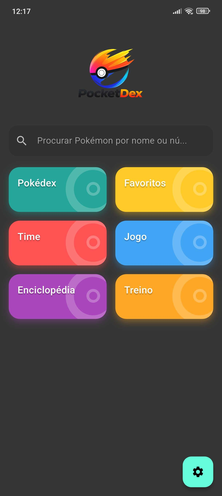
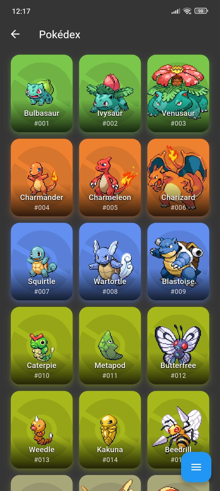
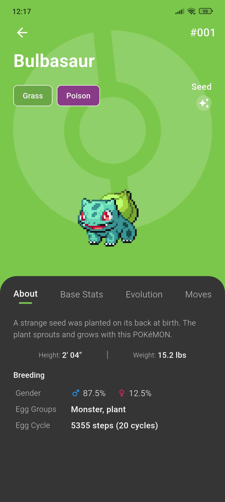
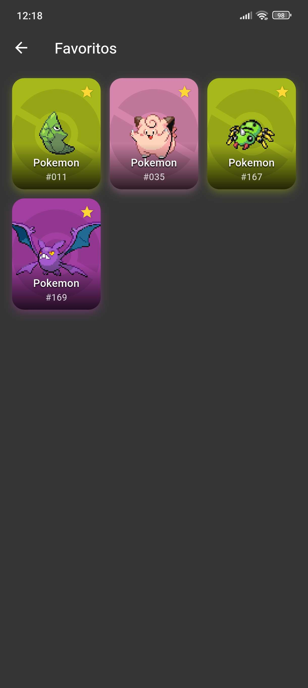
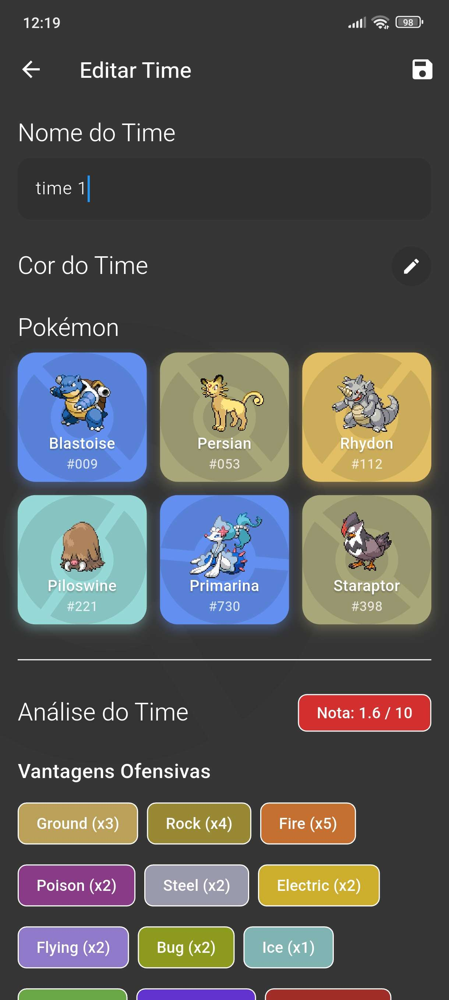
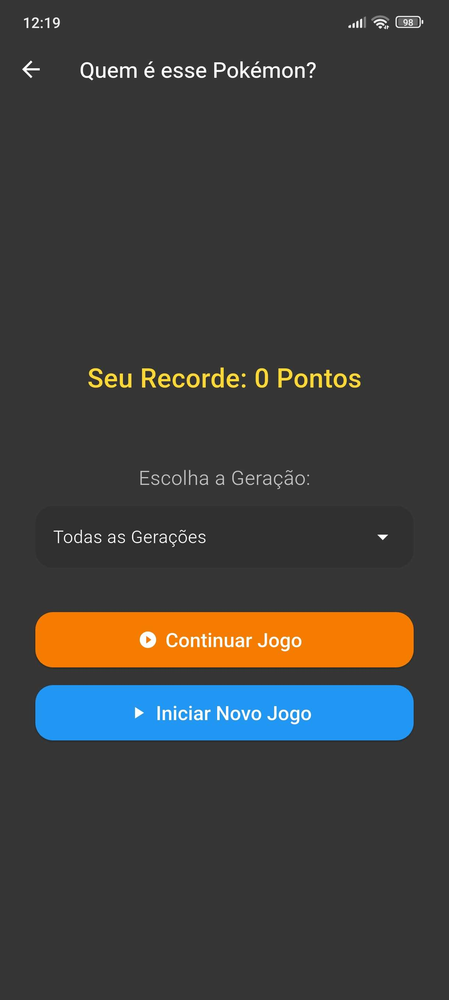
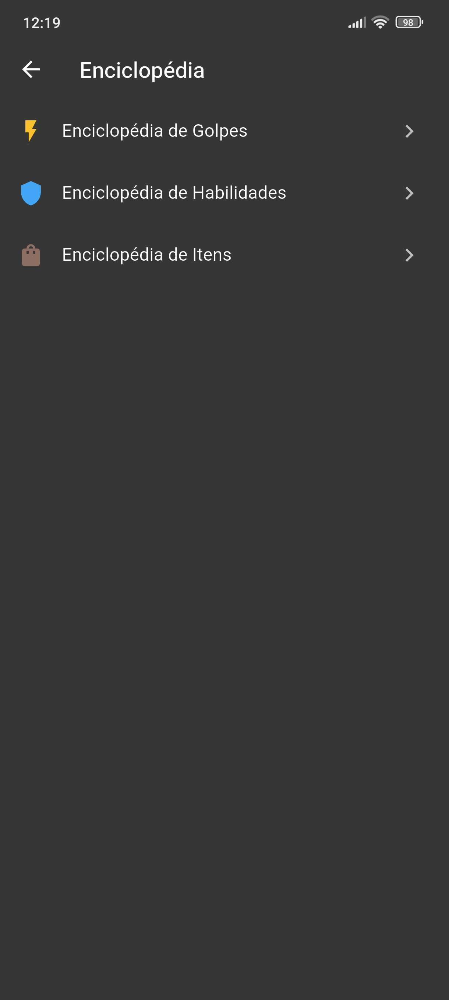
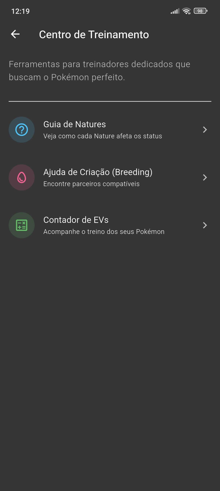

# 📱 Pocketdex

<p align="center">
  
  
  
</p>

<div align="center">
  <h3>Sua Enciclopédia Pokémon Definitiva e Assistente Competitivo</h3>
  <p>Aplicativo Flutter de alto desempenho para consulta de dados, gerenciamento de times e treinamento técnico de Pokémon.</p>
</div>

---

## 📸 Screenshots

<p align="center">
  
  
  
  
</p>
<p align="center">
  
  
  
  
</p>

---

## ✨ Funcionalidades Principais

### 🔍 Exploração e Enciclopédia
* **Pokédex Avançada:** Navegue por todas as gerações com listagem dinâmica e filtros inteligentes por tipo. Todos os dados vêm de um **banco de dados local** embutido no app — funciona sem depender de API.
* **Detalhes Profundos:** Status base, habilidades, linhas evolutivas completas e formas alternativas (Mega Evoluções, Alola, Galar, etc.).
* **Enciclopédia de Itens e Moves:** Módulos dedicados para busca técnica de movimentos e itens de segurar.

### ⚔️ Ferramentas Competitivas
* **Team Builder:** Crie e gerencie múltiplas equipas, organizando sua estratégia antes das batalhas.
* **EV Counter & Tracking:** Ferramenta integrada para registar o ganho de *Effort Values* durante o treino. Permite monitorizar o progresso exato de cada atributo.
* **Breeding Help & Partners:** Guia para encontrar parceiros compatíveis e otimizar o cruzamento de Pokémon.
* **Nature Guide:** Consulta rápida de modificadores de atributos baseados na Nature.

### 🎮 Experiência do Usuário
* **Pokémon Quiz:** Teste seus conhecimentos com um mini-game integrado e sistema de recordes.
* **Sistema de Favoritos:** Guarde seus Pokémon mais utilizados para consulta rápida.
* **Temas Personalizados:** Suporte completo para **Modo Escuro** e **Modo Claro** via `ThemeProvider`.

## 🛠️ Stack Técnica

* **Framework:** Flutter (Dart).
* **Gestão de Estado:** `Provider` (utilizado para Temas e Favoritos).
* **Banco de dados:** arquivos JSON em `assets/database/` (Pokémon, espécies, evoluções, golpes, tipos, habilidades, itens), lidos por `lib/services/local_database.dart`.
* **Persistência:** `Shared Preferences` para configurações, times, favoritos e treinos (no site, fica salvo no navegador).
* **Plataformas:** Android, iOS e **Web** (o mesmo código gera o app e o site).
* **UI/UX:** Tipografia **Circular Std** e cores dinâmicas baseadas nos tipos dos Pokémon.

## 📥 Como Baixar (APK)

1. Vá até a seção de [**Releases**](https://github.com/OctavioKonzen/Pocketdex/releases).
2. Baixe o arquivo `app-release.apk` da versão mais recente.
3. Instale no seu Android (lembre-se de permitir a instalação de fontes desconhecidas).

---

## 🚀 Como Rodar o Código

```bash
# Clone o repositório
git clone [https://github.com/OctavioKonzen/Pocketdex.git](https://github.com/OctavioKonzen/Pocketdex.git)

# Instale as dependências
flutter pub get

# Execute o app
flutter run
```

Para rodar o site, veja a seção **Site** abaixo.

---

## 🌐 Site (JavaScript + Python)

O site fica em `web-site/` e foi feito em **JavaScript** com **React**, usando as ferramentas:

* **Vite** (build e servidor de desenvolvimento), **Tailwind CSS** (estilo), **Framer Motion** (animações),
  **React Router** (páginas), **Zustand** (dados salvos no navegador), **Vitest** (testes) e **oxlint** (lint).
* **Python** (`tool/build_web_data.py`) gera os dados do site a partir do banco local: divide o banco em arquivos
  menores (um por Pokémon) e copia as imagens, para cada página baixar só o que precisa.

Tem todas as funcionalidades do app, com o mesmo visual: Pokédex (6 cards por linha, detalhes abrindo na própria
página com o Pokémon saindo da Pokébola), Favoritos, Montador de Times com análise, Quiz, Enciclopédia de golpes,
habilidades e itens, Natures, Breeding, Contador de EVs e Configurações (tema claro/escuro). Funciona no PC e no celular.

```bash
cd web-site
npm install
npm run data     # gera os dados (Python)
npm run dev      # abre o site em modo desenvolvimento
npm test         # testes
npm run build    # gera o site final em web-site/dist
```

O deploy é automático: a cada push na `main`, o workflow `.github/workflows/deploy-web.yml` gera os dados, roda
lint e testes, faz o build e publica no **GitHub Pages**: **https://octaviokonzen.github.io/Pocketdex/**

O app de celular continua em Flutter (pasta `lib/`), usando o mesmo banco de dados.

### 🔐 Login (Firebase)

O site tem login com **e-mail e senha** ou **Google**, com a opção **Manter conectado**. Quem não está logado vê
primeiro a tela de login. No cadastro a pessoa escolhe um **nome**, que não pode ser igual ao de outra pessoa.
Favoritos, times, treinos, recorde e tema ficam salvos na conta (Firestore), então aparecem em qualquer computador
(e futuramente no app, que pode usar o mesmo projeto do Firebase).

Enquanto o Firebase não estiver configurado, o site funciona sem login. Para ativar:

1. Crie um projeto em https://console.firebase.google.com e adicione um **App da Web**.
2. **Authentication → Método de login**: ative **E-mail/senha** e **Google**.
3. **Authentication → Configurações → Domínios autorizados**: adicione `octaviokonzen.github.io`.
4. **Firestore Database**: crie o banco e, em **Regras**, cole o conteúdo de `firestore.rules`.
5. Coloque a configuração do app da web em `web-site/src/lib/firebaseConfig.js`.

---

## 🗄️ Banco de Dados

O app não consulta mais a PokeAPI nem baixa imagens da internet: tudo fica em `assets/database/`.

* **Dados (JSON, ~7 MB):** todos os Pokémon e formas (inclusive Mega, Gigantamax, regionais e formas cosméticas como Unown A–Z),
  espécies, cadeias de evolução, todos os golpes (com todas as formas de aprendizado), habilidades, itens, tipos, egg groups e gerações.
* **Imagens (~67 MB):** sprites normais e shiny, artes oficiais normais e shiny de todas as formas (em WebP, na resolução original)
  e os ícones dos itens.

Tudo é gerado pelo script `tool/build_database.py` a partir dos dumps estáticos da PokeAPI. Para atualizar (ex.: novos Pokémon):

```bash
git clone --depth 1 --filter=blob:none --sparse https://github.com/PokeAPI/api-data.git
cd api-data && git sparse-checkout set data/api/v2/pokemon data/api/v2/pokemon-species \
    data/api/v2/evolution-chain data/api/v2/move data/api/v2/type data/api/v2/ability \
    data/api/v2/item data/api/v2/egg-group data/api/v2/generation data/api/v2/pokemon-form && cd ..

git clone --depth 1 --filter=blob:none --sparse https://github.com/PokeAPI/sprites.git
cd sprites && git sparse-checkout set --no-cone '/sprites/pokemon/*.png' '/sprites/pokemon/shiny/*.png' \
    '/sprites/pokemon/other/official-artwork/*.png' '/sprites/pokemon/other/official-artwork/shiny/*.png' \
    '/sprites/items/*.png' && cd ..

pip install pillow
python3 tool/build_database.py api-data sprites
```
