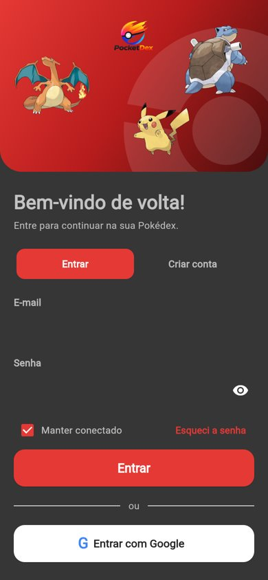
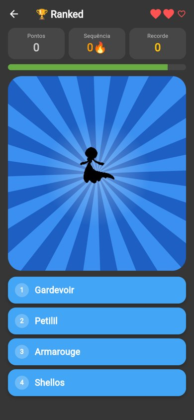
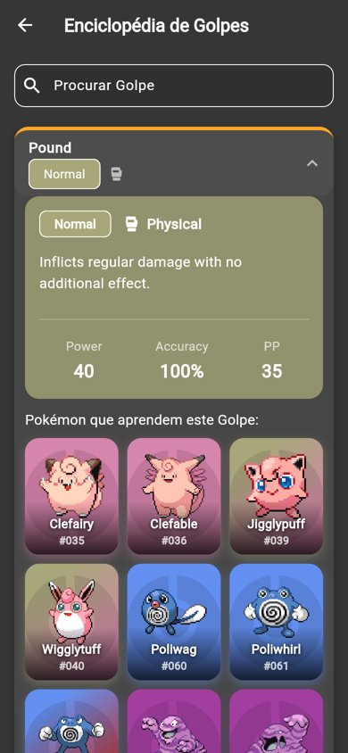
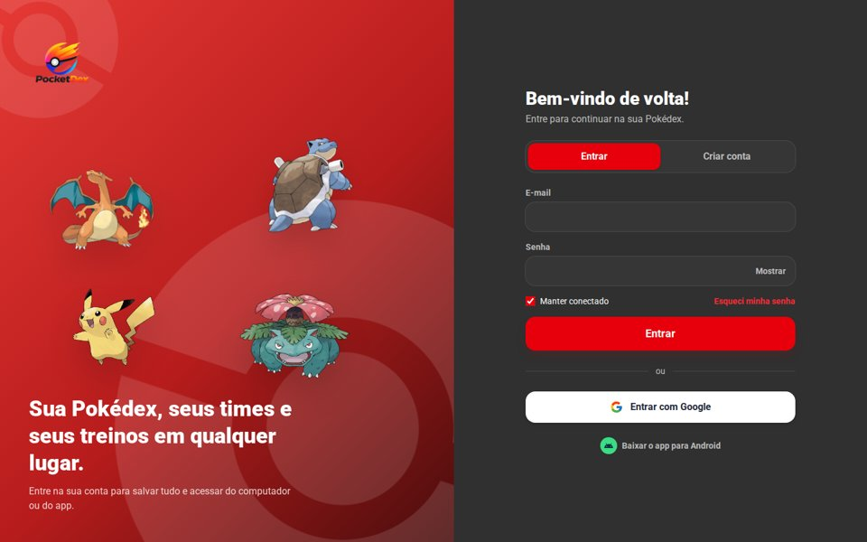
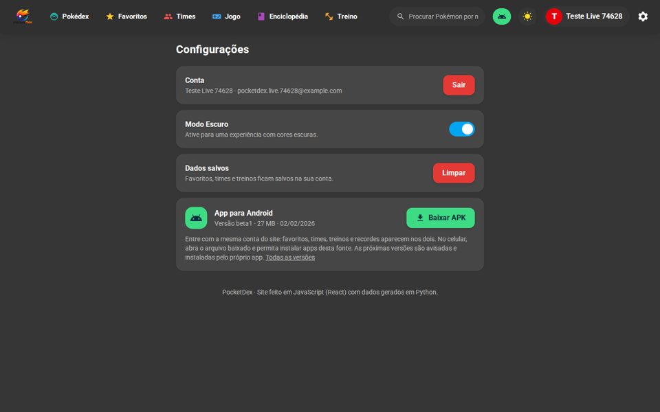

# 📱 Pocketdex

<p align="center">
  
  
  
  
  
</p>

<div align="center">
  <h3>Sua Enciclopédia Pokémon Definitiva e Assistente Competitivo</h3>
  <p>App Android em Flutter e site em React, ligados pela mesma conta: consulta de dados, times, treinos e um quiz com ranking.</p>
  <p>🌐 <a href="https://octaviokonzen.github.io/Pocketdex/"><b>octaviokonzen.github.io/Pocketdex</b></a> · 📥 <a href="https://github.com/OctavioKonzen/Pocketdex/releases"><b>Baixar o APK</b></a></p>
</div>

---

## 📸 Screenshots

### 📱 App

<p align="center">
  
  
  
</p>
<p align="center">
  
  
  
</p>

### 🌐 Site

<p align="center">
  
  
</p>
<p align="center">
  
  
</p>

<details>
<summary>Versão antiga do app (beta)</summary>
<p align="center">
  
  
  
  
</p>
<p align="center">
  
  
  
  
</p>
</details>

---

## ✨ Funcionalidades Principais

### 🔍 Exploração e Enciclopédia
* **Pokédex Avançada:** Navegue por todas as gerações com filtros por geração (botões com as cores e os 3 iniciais de cada uma) e por tipo. Todos os dados vêm de um **banco de dados local** — funciona sem depender de API.
* **Detalhes Profundos:** Status base, habilidades, linhas evolutivas completas e formas alternativas (Mega Evoluções, Alola, Galar, etc.), com o **Pokémon saindo da Pokébola** ao abrir.
* **Visual Uniforme:** Todos os Pokémon aparecem com o **mesmo tamanho visual** em qualquer tela, e as cores seguem os tipos — com **gradiente** quando o Pokémon tem dois tipos.
* **Enciclopédia de Golpes, Habilidades e Itens:** Cada item abre **logo abaixo**, empurrando a lista, com os detalhes e os Pokémon relacionados.

### ⚔️ Ferramentas Competitivas
* **Team Builder:** Crie e gerencie múltiplas equipes, com análise de fraquezas, resistências e nota do time.
* **EV Counter & Tracking:** Ferramenta integrada para registrar o ganho de *Effort Values* durante o treino. Permite monitorar o progresso exato de cada atributo.
* **Breeding Help & Partners:** Guia para encontrar parceiros compatíveis e otimizar o cruzamento de Pokémon.
* **Nature Guide:** Consulta rápida de modificadores de atributos baseados na Nature.

### 🎮 Quem é esse Pokémon?
* **Jogo Normal:** Adivinhe o Pokémon pela silhueta entre 4 opções, com 3 vidas e escolha de geração. O jogo fica salvo para continuar depois — até em outro aparelho.
* **Modo Ranked:** Todas as gerações e só **5 segundos por Pokémon**, com barra de tempo. É o recorde dele que entra no ranking.
* **Ranking:** Os 10 maiores recordes do Ranked entre todos os jogadores, com a sua posição — o mesmo no app e no site.

### 👤 Conta e Sincronização
* **Login:** E-mail e senha ou **Google**, com a opção **Manter conectado** e recuperação de senha. Quem não está logado vê primeiro a tela de login.
* **Nome Único:** No cadastro a pessoa escolhe um nome, que não pode ser igual ao de outra pessoa.
* **Mesma Conta no App e no Site:** Favoritos, times, treinos, tema e recordes ficam na conta e são **sincronizados em tempo real** — um time criado no celular aparece no site na hora, e vice-versa.

### 📲 Experiência do Usuário
* **Sistema de Favoritos:** Guarde seus Pokémon mais utilizados para consulta rápida (duplo toque no card).
* **Temas Personalizados:** Suporte completo para **Modo Escuro** e **Modo Claro**, salvo na conta.
* **Atualização pelo App:** Quando sai uma versão nova, o próprio app avisa, baixa e instala.

## 🛠️ Stack Técnica

* **App:** Flutter (Dart), com `Provider` para o estado.
* **Site:** React 19 + Vite, Tailwind CSS, Framer Motion, React Router e Zustand (pasta `web-site/`).
* **Conta:** **Firebase** — Authentication (e-mail/senha e Google) e **Firestore** (dados da conta, nomes e ranking).
* **Banco de dados:** arquivos JSON em `assets/database/` (Pokémon, espécies, evoluções, golpes, tipos, habilidades, itens), lidos por `lib/services/local_database.dart` no app e convertidos para o site por Python.
* **Persistência:** `Shared Preferences` no app e `localStorage` no site, sincronizados com a conta.
* **Atualizações:** APK publicado em **GitHub Releases**; o app confere a última versão e instala com `ota_update`.
* **UI/UX:** Tipografia **Circular Std** e cores dinâmicas baseadas nos tipos dos Pokémon.

## 📥 Como Baixar (APK)

1. No site, clique em **Baixar app** (menu de cima) ou vá até [**Releases**](https://github.com/OctavioKonzen/Pocketdex/releases).
2. Baixe o `PocketDex.apk` da versão mais recente.
3. Instale no seu Android (lembre-se de permitir a instalação de fontes desconhecidas).
4. Entre com a **mesma conta do site** (ou crie uma).

As próximas versões são avisadas pelo próprio app, que baixa e instala a atualização.

> ℹ️ A partir da versão 1.1.0 o app se chama `com.octaviokonzen.pocketdex` (antes era `com.example.myapp`, o nome
> padrão de exemplo do Flutter, que podia conflitar com outros apps). Se você tem a versão beta, desinstale-a.

### Publicar uma versão nova do app

Aumente a versão em `pubspec.yaml` (ex.: `1.1.0+2` → `1.2.0+3`) e mande para a `main`. O workflow
`.github/workflows/android-release.yml` gera o APK assinado e publica em Releases. Ele precisa destes secrets
(**Settings → Secrets and variables → Actions**):

| Secret | O que é |
|---|---|
| `ANDROID_KEYSTORE_BASE64` | chave de assinatura (`.jks`) em base64 — sempre a mesma, senão o Android não instala a atualização |
| `ANDROID_KEYSTORE_PASSWORD` / `ANDROID_KEY_PASSWORD` | senhas da chave |
| `ANDROID_KEY_ALIAS` | apelido da chave |
| `GOOGLE_SERVICES_JSON` | conteúdo do `google-services.json` do app Android no Firebase (`com.octaviokonzen.pocketdex`) |

Sem os secrets o workflow gera o APK só como teste (confere que o app compila) e não publica. No APK as artes
oficiais são reduzidas para 320 px (`tool/shrink_app_images.py`) e só entram as bibliotecas ARM, para ele ficar menor.

Para compilar no PC com login, coloque o `google-services.json` em `android/app/` (e, para gerar a versão
assinada, um `android/key.properties` com `storeFile`, `storePassword`, `keyAlias` e `keyPassword`). Os dois ficam
fora do git.

---

## 🚀 Como Rodar o Código

```bash
# Clone o repositório
git clone https://github.com/OctavioKonzen/Pocketdex.git

# Instale as dependências
flutter pub get

# Execute o app
flutter run

# Testes do app
flutter test
```

Sem o `google-services.json` o app abre normalmente, só que sem login. Para rodar o site, veja a seção **Site** abaixo.

---

## 🌐 Site (JavaScript + Python)

O site fica em `web-site/` e foi feito em **JavaScript** com **React**, usando as ferramentas:

* **Vite** (build e servidor de desenvolvimento), **Tailwind CSS** (estilo), **Framer Motion** (animações),
  **React Router** (páginas), **Zustand** (dados salvos no navegador), **Vitest** (testes) e **oxlint** (lint).
* **Python** (`tool/build_web_data.py`) gera os dados do site a partir do banco local: divide o banco em arquivos
  menores (um por Pokémon) e copia as imagens, para cada página baixar só o que precisa.

Tem todas as funcionalidades do app, com o mesmo visual adaptado para o PC: menu fixo no topo com a Pokédex como
página principal (6 cards por linha, detalhes abrindo na própria página com o Pokémon saindo da Pokébola),
Favoritos, Montador de Times com análise, Jogo com Ranked e ranking, Enciclopédia de golpes, habilidades e itens,
Natures, Breeding, Contador de EVs, Configurações (tema claro/escuro e conta) e o download do app para Android.
Funciona no PC e no celular.

```bash
cd web-site
npm install
npm run data     # gera os dados (Python)
npm run dev      # abre o site em modo desenvolvimento
npm test         # testes
npm run build    # gera o site final em web-site/dist
```

O deploy é automático: a cada push na `main`, o workflow `.github/workflows/deploy-web.yml` gera os dados, roda
lint e testes, faz o build e publica no **GitHub Pages**: **https://octaviokonzen.github.io/Pocketdex/**

---

## 🔐 Login e Conta (Firebase)

O app e o site usam o **mesmo projeto do Firebase** (`pocketdex-ffb4d`):

* **Authentication:** e-mail e senha ou Google. O "Manter conectado" guarda a sessão; desmarcado, ela termina ao
  fechar o app ou a aba.
* **Firestore:**
  * `users/{uid}` — nome, e-mail e os dados da conta (`data`: favoritos, times, treinos, tema, recordes e jogo salvo).
  * `usernames/{nome}` — reserva de nomes; o nome é comparado sem maiúsculas, acentos e espaços extras.
  * `ranking/{uid}` — recorde do Ranked de cada jogador.
* **Regras:** em `firestore.rules` — cada pessoa só lê e escreve os próprios dados; o ranking é visível para quem
  está logado.
* **Sincronização:** app (`lib/services/account_sync.dart`) e site (`web-site/src/lib/sync.js`) ouvem a conta em
  tempo real e gravam só os campos que mudaram, no mesmo formato, para um não sobrescrever o outro.

Enquanto o Firebase não estiver configurado, o app e o site funcionam sem login. Para configurar do zero:

1. Crie um projeto em https://console.firebase.google.com e adicione um **App da Web** e um **App Android**
   (`com.octaviokonzen.pocketdex`, com a impressão digital SHA-1 da chave de assinatura).
2. **Authentication → Método de login**: ative **E-mail/senha** e **Google**.
3. **Authentication → Configurações → Domínios autorizados**: adicione `octaviokonzen.github.io`.
4. **Firestore Database**: crie o banco e, em **Regras**, cole o conteúdo de `firestore.rules`.
5. Coloque a configuração do app da web em `web-site/src/lib/firebaseConfig.js` e o `google-services.json` do app
   Android nos secrets do GitHub (veja **Publicar uma versão nova do app**).

---

## 🗄️ Banco de Dados

O app não consulta mais a PokeAPI nem baixa imagens da internet: tudo fica em `assets/database/`.

* **Dados (JSON, ~7 MB):** todos os Pokémon e formas (inclusive Mega, Gigantamax, regionais e formas cosméticas como Unown A–Z),
  espécies, cadeias de evolução, todos os golpes (com todas as formas de aprendizado), habilidades, itens, tipos, egg groups e gerações.
* **Imagens (~67 MB):** sprites normais e shiny, artes oficiais normais e shiny de todas as formas (em WebP, na resolução original)
  e os ícones dos itens.
* **Recorte dos sprites:** `sprite_boxes.json` diz onde cada Pokémon fica dentro do sprite, para todos aparecerem
  com o mesmo tamanho (gerado por `tool/build_sprite_boxes.py`).

Tudo é gerado pelo script `tool/build_database.py` a partir dos dumps estáticos da PokeAPI. Para atualizar (ex.: novos Pokémon):

```bash
git clone --depth 1 --filter=blob:none --sparse https://github.com/PokeAPI/api-data.git
cd api-data && git sparse-checkout set data/api/v2/pokemon data/api/v2/pokemon-species \
    data/api/v2/evolution-chain data/api/v2/move data/api/v2/type data/api/v2/ability \
    data/api/v2/item data/api/v2/egg-group data/api/v2/generation data/api/v2/pokemon-form && cd ..

git clone --depth 1 --filter=blob:none --sparse https://github.com/PokeAPI/sprites.git
cd sprites && git sparse-checkout set --no-cone '/sprites/pokemon/*.png' '/sprites/pokemon/shiny/*.png' \
    '/sprites/pokemon/other/official-artwork/*.png' '/sprites/pokemon/other/official-artwork/shiny/*.png' \
    '/sprites/items/*.png' && cd ..

pip install pillow
python3 tool/build_database.py api-data sprites
python3 tool/build_sprite_boxes.py
```

Outros scripts em `tool/`: `build_app_icon.py` gera o ícone do app a partir da logo e `shrink_app_images.py` reduz
as artes só para o APK.
