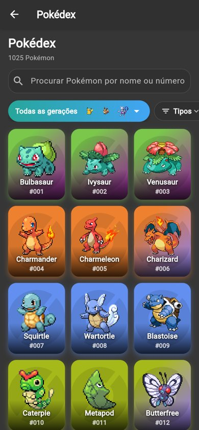
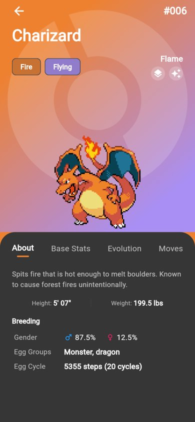
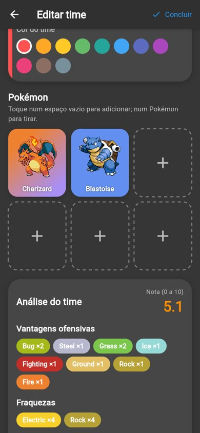
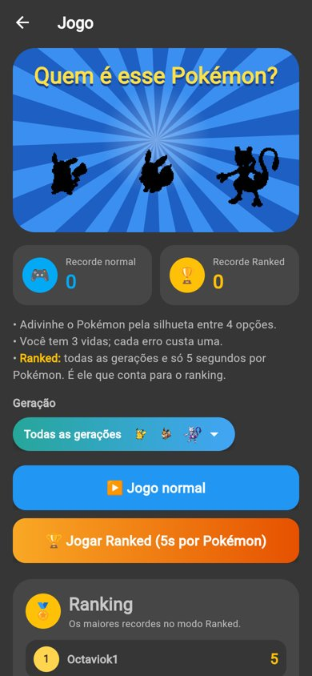
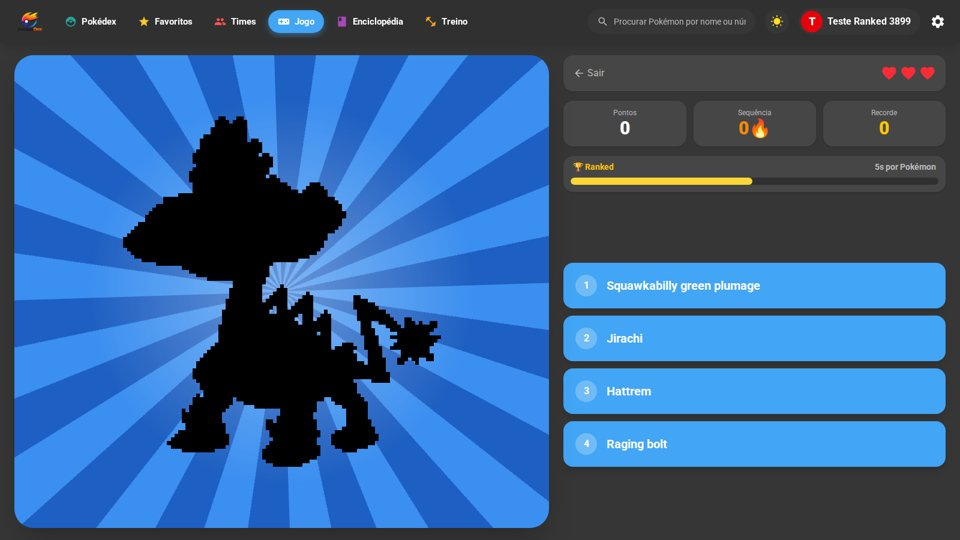
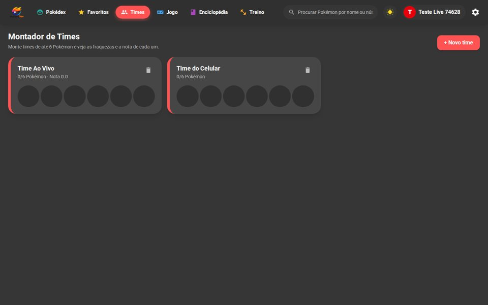

# 📱 Pocketdex

<p align="center">
  
  
  
  
</p>

<div align="center">
  <h3>Sua Enciclopédia Pokémon e Assistente Competitivo</h3>
  <p>App Android e site ligados pela mesma conta.</p>
  <p>🌐 <a href="https://octaviokonzen.github.io/Pocketdex/"><b>Abrir o site</b></a> · 📥 <a href="https://github.com/OctavioKonzen/Pocketdex/releases"><b>Baixar o APK</b></a></p>
</div>

---

## 📸 Screenshots

<p align="center">
  
  
  
  
</p>
<p align="center">
  
  
</p>

---

## ✨ O que tem no projeto

* **Pokédex:** Pokémon, Megas e outras formas, filtros, evoluções, status, habilidades e golpes.
* **Sprites:** versões normais e shiny, com animações configuráveis.
* **Favoritos e coleção:** salve seus favoritos e acompanhe capturas por jogo e por forma.
* **Times:** monte equipes de até 6 Pokémon, escolha a mecânica de cada Pokémon (Mega, Tera, Dynamax/Gigantamax ou Z), analise a cobertura de tipos e compartilhe por link, código ou Pokémon Showdown. Veja também os times oficiais dos personagens (líderes, Elite Four, campeões, rivais e vilões) de cada jogo principal, da 1ª à 9ª geração, com nível, golpes, item, IVs/DVs, EVs, nature e habilidade.
* **Comunidade:** publique times, pesquise treinadores, avalie e salve equipes.
* **Amigos e chat:** adicione amigos, converse e envie desafios do quiz ou convites de batalha online.
* **Jogos e conquistas:** “Quem é esse Pokémon?”, Ranked, desafio diário, desafios entre amigos, rankings e medalhas.
* **Batalhas e draft:** batalhe online por turnos com amigos, cada um controlando seu time, com nível máximo 50 e um uso de cada mecânica por time em cada batalha; jogue individual, dupla ou tripla com amigos e NPCs. Escolha seu time ou um aleatório e treine nas dificuldades Normal (IVs/EVs aleatórios) e Difícil (sets otimizados), com Mega, Tera, Dynamax/Gigantamax e Z-Move. Também há montagem de equipes pelo draft.
* **Regras de combate:** efeitos de golpes, precisão, status, clima, terrenos, Natures e habilidades comuns e ocultas, com o mesmo motor offline no app e no site.
* **Duplas e triplas:** controle todas as posições ou forme equipes com amigos e NPCs, inclusive amigos juntos contra a máquina. Até quatro jogadores na dupla e seis na tripla, com seis Pokémon por equipe e reserva compartilhada.
* **Centro de Batalha:** calculadora de dano, comparador, tabela de tipos, velocidade, sugestões de adversários e Tera Raids.
* **Treinamento:** Natures, breeding, golpes de ovo, EVs, IVs, contador de shiny e acompanhamento de Nuzlocke.
* **Enciclopédia:** consulta de golpes, habilidades e itens.
* **Conta e preferências:** login por Google ou e-mail, sincronização entre app e site, tema claro/escuro e atualização pelo próprio app.

## 💚 Apoie o projeto

O PocketDex é gratuito e sem anúncios. Se ele te ajuda, qualquer valor por **Pix** ajuda a manter o projeto:

**Chave Pix (aleatória):** `b2f17626-44c0-421d-9a60-71a33b272741`

No app e no site, em **Configurações**, tem o QR Code e o "Pix copia e cola".

## 🛠️ Ferramentas usadas

| Parte | Ferramentas |
|---|---|
| **App (Android)** | Flutter / Dart, Provider |
| **Site** | React, Vite, Tailwind CSS, Framer Motion, React Router, Zustand |
| **Conta e dados online** | Firebase Authentication e Firestore |
| **Banco de dados local** | JSON e imagens em `assets/database/`, gerados com Python a partir da PokeAPI |
| **Publicação** | GitHub Actions (conferência automática, site no GitHub Pages e APK em Releases) |

## 📥 Como usar

* **Site:** https://octaviokonzen.github.io/Pocketdex/
* **App:** no site, clique em **Baixar app** (ou vá em [Releases](https://github.com/OctavioKonzen/Pocketdex/releases)), instale o `PocketDex.apk` e entre com a mesma conta do site.

## 🚀 Como rodar o código

```bash
git clone https://github.com/OctavioKonzen/Pocketdex.git
cd Pocketdex

# App
flutter pub get
flutter run

# Site
cd web-site
npm install
npm run data
npm run dev
```

Detalhes técnicos (Firebase, publicação de versões, banco de dados): [docs/DESENVOLVIMENTO.md](docs/DESENVOLVIMENTO.md).

## 🙏 Créditos

* Dados e sprites: [PokeAPI](https://pokeapi.co/) (repositório [PokeAPI/sprites](https://github.com/PokeAPI/sprites)). Pokémon e os nomes, imagens e sons são da Nintendo, Game Freak e The Pokémon Company.
* Sprites animados, no banco do site (o app puxa da nuvem): no estilo Black & White, os oficiais do Black & White (até o #649) e, do #650 em diante, os animados no estilo BW da pasta `gen5ani` do Pokémon Showdown; sem animação BW, a arte BW parada do [Smogon Sprite Project](https://www.smogon.com/forums/forums/smeargles-studio.258/) ([smogon/sprites](https://github.com/smogon/sprites)), também nas costas (`tool/bw_style_sprites.py`). Animações BW feitas por fãs para quem não tem a do Showdown: [Animated sprites by Ghasty001](https://github.com/Ghasty001/Animated_sprites_by_Ghasty001) e os artistas das bases (hexagonereal, Kyledove, Bloxable, KingOfThe-X-Roads, G.E.Z, Katten, aXl, Antiant e os outros listados lá) (`tool/fan_sprites.py`). A maior parte das animações (todos os Pokémon, Megas, formas regionais e formas só de aparência, como Vivillon, Unown e Alcremie) vem do [Animated Pokemon System](https://eeveeexpo.com/resources/1544/) (plugin do Pokémon Essentials por Lucidious89, baseado no Generation 8 Pack de Golisopod User e no EBDX de Luka S.J.): as animações do plugin espanhol "Sprites Animados" (Tenshi of War, DPertierra, Skyflyer, Hellfire_raptor, Antiant, Diegotoon20, KingOfThe-X-Roads e os outros listados lá) sobre os sprites dos projetos X/Y, Sun/Moon, Sword/Shield e Scarlet/Violet da Smogon (`tool/aps_sprites.py`). Mega Zygarde: animação de [RetroNC](https://www.youtube.com/@RetroNC) ([DeviantArt](https://www.deviantart.com/retronc/art/Mega-Zygarde-Gen-5-Pokemon-Sprite-1260116710)). Charizard Gigantamax: animação de [noirium](https://www.deviantart.com/noirium) ([DeviantArt](https://www.deviantart.com/noirium/art/Gigantamax-Charizard-Animated-Sprite-934376791)), usada sem fins lucrativos, com crédito ao artista. Gigantamax (frente e costas, inclusive o Charizard de costas e shiny), Eternamax e Zarude Dada: animações de [mangalos810](https://www.deviantart.com/mangalos810) (DeviantArt), usadas sem fins lucrativos, com crédito ao artista. Desenhados em escala inteira (cada pixel do mesmo tamanho, sem borrar).
* Treinadores da batalha e da foto de perfil (`tool/build_trainers.py`): os sprites animados no estilo Black & White do [Elite Battle System / EBDX](https://luka-sj.com/res/ebs4) para Pokémon Essentials (Luka S.J. e os spriters da comunidade listados lá), base © Nintendo/Game Freak; usados sem fins lucrativos, com crédito aos autores.
* Líderes, Elite Four, campeões, vilões e protagonistas animados (`tool/build_leader_trainers.py`): pacote [Animated Trainer Intros](https://eeveeexpo.com/resources/1667/) (add-on do Deluxe Battle Kit, Lucidious89, sobre o Animated Pokémon System e o EBDX de Luka S.J.), sprites das gerações 4 e 5 © Nintendo/Game Freak; usados sem fins lucrativos, com crédito aos autores.
* Desafio dos Líderes (`tool/build_gym_leaders.py`): os times originais de cada líder de ginásio, Elite Four e campeão, já evoluídos e no nível 50.
* Treinadores do [Pokémon Showdown](https://play.pokemonshowdown.com/sprites/trainers/) (`tool/build_showdown_trainers.py`): sprites 80 × 80 © Nintendo/Game Freak e dos artistas creditados em [play.pokemonshowdown.com/credits](https://pokemonshowdown.com/credits); usados sem fins lucrativos, com crédito aos autores.
* Times oficiais dos personagens (`tool/build_official_teams.py`): tirados do código dos jogos pelos projetos de desmontagem do [pret](https://github.com/pret) (pokered, pokeyellow, pokegold, pokecrystal, pokeruby, pokeemerald, pokefirered e pokeplatinum); nature, habilidade e IVs calculados como o próprio jogo faz. Black 2/White 2: a desmontagem [pokebw2](https://github.com/fuddlesworth/pokebw2), com a nature e a habilidade calculadas como o jogo (`tr_tool.c`). Scarlet/Violet (versão 1.0, sem as DLCs): a tabela de treinadores do jogo (`trdata_array`) como está no [SV-Randomizer](https://github.com/XLuma/SV-Randomizer), com a conversão das espécies do [PKHeX](https://github.com/kwsch/PKHeX). Diamond/Pearl, HeartGold/SoulSilver, Black/White, X/Y, Omega Ruby/Alpha Sapphire, Sun/Moon, Ultra Sun/Ultra Moon, Sword/Shield e Brilliant Diamond/Shining Pearl (marcados como dados da comunidade): os dados de treinadores do [Trevenant](https://github.com/zacharybussey/Trevenant) (MIT), vindos do VanillaNuzlockeCalc (Honko e colaboradores). Só os dados (níveis, golpes, itens), nenhum código dos jogos.
* Calculadora de dano ([@smogon/calc](https://github.com/smogon/damage-calc)), sets prontos e regras dos golpes do [Pokémon Showdown](https://github.com/smogon/pokemon-showdown) (licença MIT).
